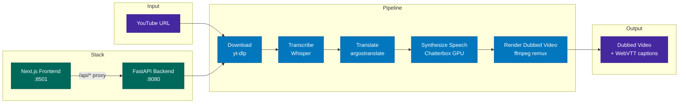

# Foreign Whispers

[](./LICENSE)

YouTube video dubbing pipeline — transcribe, translate, and dub English
interviews into a target language (Spanish by default) using fully
open-source models.

---

## About This Fork

This repository is a **course submission** for *NYU AI (Spring 2026)*.
It is a fork of [`aegean-ai/foreign-whispers`](https://github.com/aegean-ai/foreign-whispers),
a reference dubbing pipeline released by Aegean AI Inc. for educational use.

**What this fork adds on top of the upstream project:**

- **`api/src/services/download_engine.py`** — `yt-dlp` format string now prefers
  single-file progressive MP4 formats (fmt `18`) so the pipeline can download
  videos on hosts without a system-wide `ffmpeg` install (e.g. HPC login
  nodes), and gracefully falls back when YouTube rotates its Adaptive (SABR)
  format availability.
- **`api/src/services/tts_engine.py`** — when the caller requests
  `alignment=False`, TTS no longer invokes `pyrubberband.time_stretch`.
  This fixes a `RuntimeError: Failed to execute rubberband` crash on systems
  where `rubberband-cli` is not installed. Segment-level pad/trim still
  handles duration alignment.
- **`docs/deployment/hpc.md`** — a new end-to-end deployment guide for
  running the pipeline on NYU Torch HPC (Slurm + Apptainer on H100 nodes).
- **`notebooks/pipeline_end_to_end/pipeline_end_to_end.ipynb`** — an
  executed run of the end-to-end notebook with preserved outputs so the
  pipeline is readable on GitHub without re-execution.

A sample dubbed video (`Strait of Hormuz disruption threatens to shake
global economy`, 60 Minutes, English → Spanish) is included as the
course-required sample input/output pair — see *Sample Results* below.

---

## Architecture



The four services communicate over HTTP. GPU work (Whisper STT,
Chatterbox TTS) is isolated into dedicated containers; the FastAPI
orchestrator and the Next.js frontend are CPU-only.

---

## Prerequisites

The pipeline is **GPU-required** for realistic performance. STT uses
`Systran/faster-whisper-medium` (~1.5 GB model) and TTS uses Chatterbox
multilingual (~3 GB model); together they need ~6–8 GB of VRAM.

| Component            | Required                                      |
|----------------------|-----------------------------------------------|
| Docker               | ≥ 20.10 with Compose v2                       |
| NVIDIA GPU           | Compute Capability ≥ 7.0, ≥ 8 GB VRAM         |
| NVIDIA driver        | Supports CUDA 12.x                            |
| NVIDIA Container Toolkit | Installed and enabled for Docker          |
| Disk space           | ~15 GB for images + models on first run       |
| Host RAM             | ≥ 16 GB                                       |

> **No local NVIDIA GPU?** See [`docs/deployment/hpc.md`](docs/deployment/hpc.md)
> for the HPC deployment path (tested on NYU Torch with H100 nodes). A
> CPU-only mode is not shipped because Chatterbox TTS currently has no
> production-ready CPU backend.

---

## Quick Start (Local, NVIDIA GPU)

```bash
# 1. Clone
git clone https://github.com/yuelihe2-svg/foreign-whispers-project.git
cd foreign-whispers-project

# 2. Configure environment
cp .env.example .env
# (optional) edit .env to add your Hugging Face token if you plan to
# enable speaker diarization. The core pipeline works without it.

# 3. Bring the stack up
docker compose --profile nvidia up -d

# 4. Verify all four services are healthy
curl http://localhost:8080/healthz        # FastAPI
curl http://localhost:8000/health         # Whisper STT
curl http://localhost:8020/v1/models      # Chatterbox TTS
# Frontend: open http://localhost:8501 in a browser

# 5. Drive the pipeline from the browser, or from Python:
uv run python -c "from foreign_whispers import FWClient; \
  c = FWClient(); print(c.download('GYQ5yGV_-Oc'))"
```

First run downloads ~8 GB of Docker images plus another ~5 GB of model
weights that are cached into named Docker volumes (`whisper-cache`,
`chatterbox-models`). Subsequent runs start in seconds.

To shut down:

```bash
docker compose --profile nvidia down
```

To tail logs:

```bash
docker compose --profile nvidia logs -f api
```

---

## Local Demo (Windows / macOS Docker Desktop, no GPU)

If you don't have an NVIDIA GPU but want to **demo cached results** that
were already produced on the HPC (or Quick-Start path), you can bring up
just the API + Frontend on Docker Desktop:

```bash
docker compose -f docker-compose.yml -f docker-compose.windows.yml \
               --profile cpu up -d api frontend
```

Then open <http://localhost:8501>. Pre-existing artifacts under
`pipeline_data/api/` are served as-is; clicking **Start Pipeline** on a
video that already has cache will trace through all 5 stages in ~2 seconds
(every stage is idempotent and short-circuits when its artifact exists).

> **Important caveats**
>
> - Do *not* click **Start Pipeline** on a video that has *no* cache —
>   Whisper / argos will run on CPU, saturate the API container, and make
>   it look frozen for many minutes.
> - The Whisper STT and Chatterbox TTS containers (`--profile nvidia`)
>   are intentionally **not** launched here. CPU TTS is not supported.
> - `docker-compose.windows.yml` is a layered overlay (not an auto-loaded
>   `override.yml`) on purpose, so HPC / Linux GPU hosts are unaffected.

A placeholder `cookies.txt` (a valid but empty Netscape cookies file) is
required in the project root because Docker bind-mounts it into the API
container. Copy the provided template:

```bash
cp cookies.txt.example cookies.txt
```

Without this file, Docker auto-creates a *directory* at the mount target
and `yt-dlp` errors with *"Is a directory: '/app/cookies.txt'"*. The empty
placeholder works fine for public videos; only age-restricted or
private content needs real cookies. `cookies.txt` is gitignored so any
real session cookies you paste in won't be committed.

---

## Deployment Options

| Target                                         | Guide                                                                              |
|------------------------------------------------|------------------------------------------------------------------------------------|
| Local workstation with NVIDIA GPU              | *Quick Start* above                                                                |
| Local Windows / macOS Docker Desktop, no GPU   | *Local Demo* above (cache-only, demos pre-processed videos)                        |
| HPC cluster (Slurm + Apptainer)                | [`docs/deployment/hpc.md`](docs/deployment/hpc.md)                                 |
| Pure library work (alignment, evaluation)      | *Development → Local setup (no Docker)* below                                      |

---

## Pipeline Stages

| Stage | What it does | Output |
|-------|-------------|--------|
| **Download** | Fetch video + captions from YouTube via yt-dlp | `videos/`, `youtube_captions/` |
| **Transcribe** | Speech-to-text via Whisper | `transcriptions/whisper/` |
| **Translate** | Source → target language via argostranslate (offline, OpenNMT) | `translations/argos/` |
| **Synthesize Speech** | TTS via Chatterbox (GPU), time-aligned to original segments | `tts_audio/chatterbox/` |
| **Render Dubbed Video** | Replace audio track via ffmpeg remux (no re-encoding) | `dubbed_videos/` |

Captions are served as WebVTT via the `<track>` element — no subtitle burn-in:

| Endpoint | Source | Output |
|----------|--------|--------|
| `GET /api/captions/{id}/original` | YouTube captions (generated on the fly) | — |
| `GET /api/captions/{id}` | Translated segments + YouTube timing offset | `dubbed_captions/*.vtt` |

---

## Sample Results

A reproduced end-to-end run using this fork on NYU Torch (1× H100):

| Stage           | Wall-clock time | Artifact (path relative to `pipeline_data/api/`)                        |
|-----------------|-----------------|-------------------------------------------------------------------------|
| Download        | ~6 s            | `videos/Strait of Hormuz disruption threatens to shake global economy.mp4` |
| Transcribe      | ~14 s           | `transcriptions/whisper/*.json` (170 Whisper segments, EN)              |
| Translate       | ~3 s            | `translations/argos/*.json`                                             |
| TTS Synthesis   | ~90 s           | `tts_audio/chatterbox/*.wav`                                            |
| Stitch          | ~2 s            | `dubbed_videos/c-*/Strait of Hormuz....mp4`                             |

Input/output media artifacts are **not** committed (see `.gitignore` —
`*.mp4`, `pipeline_data/`). They are reproducible by running the pipeline,
and the sample pair is included in the course submission bundle separately.

---

## API Endpoints

| Method | Endpoint | Description |
|--------|----------|-------------|
| POST | `/api/download` | Download YouTube video + captions |
| POST | `/api/transcribe/{id}` | Whisper speech-to-text |
| POST | `/api/translate/{id}` | Source → target language translation |
| POST | `/api/tts/{id}` | Time-aligned TTS synthesis |
| POST | `/api/stitch/{id}` | Audio remux (ffmpeg -c:v copy) |
| GET | `/api/video/{id}` | Stream dubbed video (range requests) |
| GET | `/api/video/{id}/original` | Stream original video (range requests) |
| GET | `/api/captions/{id}` | Translated WebVTT captions |
| GET | `/api/captions/{id}/original` | Original English WebVTT captions |
| GET | `/api/audio/{id}` | TTS audio (WAV) |
| GET | `/healthz` | Health check |

---

## Project Structure

```
foreign-whispers/
├── api/src/                     # FastAPI backend (layered architecture)
│   ├── main.py                  # App factory + lazy model loading
│   ├── core/config.py           # Pydantic settings (FW_ env prefix)
│   ├── routers/                 # Thin route handlers
│   │   ├── download.py          # POST /api/download
│   │   ├── transcribe.py        # POST /api/transcribe/{id}
│   │   ├── translate.py         # POST /api/translate/{id}
│   │   ├── tts.py               # POST /api/tts/{id}
│   │   └── stitch.py            # POST /api/stitch/{id}, GET /api/video/*, /api/captions/*
│   ├── services/                # Business logic (HTTP-agnostic)
│   ├── schemas/                 # Pydantic request/response models
│   └── inference/               # ML model backend abstraction
├── frontend/                    # Next.js + shadcn/ui
│   ├── src/components/          # Pipeline tracker, video player, result panels
│   ├── src/hooks/use-pipeline.ts # State machine for pipeline orchestration
│   └── src/lib/api.ts           # API client
├── foreign_whispers/            # Alignment / evaluation library
├── notebooks/                   # Jupyter notebooks (end-to-end + per-stage)
├── pipeline_data/               # All intermediate and output files (git-ignored)
├── docs/
│   ├── deployment/hpc.md        # NYU Torch HPC deployment guide (this fork)
│   └── tts-temporal-alignment-research.md
├── docker-compose.yml           # Profiles: nvidia (full stack), cpu (api + frontend only)
├── Dockerfile                   # API container
├── .env.example                 # Template — copy to .env and fill in secrets
└── video_registry.yml           # Catalogue of pipeline-ready videos
```

---

## Development

### Container architecture

```
Host machine
├── foreign_whispers/      ← bind-mounted into API container
├── api/                   ← bind-mounted into API container
├── pipeline_data/api/     ← bind-mounted into API container
│
└── Docker Compose
    ├── foreign-whispers-stt   (GPU)  :8000  — Whisper inference
    ├── foreign-whispers-tts   (GPU)  :8020  — Chatterbox inference
    ├── foreign-whispers-api   (CPU)  :8080  — FastAPI orchestrator
    └── foreign-whispers-frontend      :8501  — Next.js UI
```

The API container is CPU-only — it delegates all GPU work to the STT and TTS
containers via HTTP. The `foreign_whispers/` library and `api/` source are
**bind-mounted** from the host, so edits on the host are immediately visible
inside the container.

### Editing and debugging the library

1. **Start all services:**

   ```bash
   docker compose --profile nvidia up -d
   ```

2. **Edit any file** in `foreign_whispers/` or `api/` on the host (e.g. in VS Code).

3. **Restart the API container** to pick up changes:

   ```bash
   docker compose --profile nvidia restart api
   ```

   To avoid manual restarts, add `--reload` to the uvicorn command in
   `docker-compose.yml`:

   ```yaml
   command: ["uv", "run", "uvicorn", "api.src.main:app", "--host", "0.0.0.0", "--port", "8080", "--reload"]
   ```

   With `--reload`, uvicorn watches for file changes and restarts automatically.

4. **Test via the SDK** from a notebook or Python REPL on the host:

   ```python
   from foreign_whispers import FWClient
   fw = FWClient()             # connects to http://localhost:8080
   fw.transcribe("GYQ5yGV_-Oc")
   ```

5. **Test the library directly** (no Docker needed for pure-Python alignment work):

   ```python
   from foreign_whispers import global_align, compute_segment_metrics, clip_evaluation_report
   ```

   This is the two-phase workflow:
   - **Phase 1 (SDK):** Call `FWClient` methods to drive the pipeline through Docker (download, transcribe, translate, TTS, stitch). Data lands in `pipeline_data/api/`.
   - **Phase 2 (library):** Import `foreign_whispers` directly to iterate on alignment algorithms using data produced in Phase 1. No GPU or Docker needed.

### Local setup (no Docker)

```bash
uv sync                    # install all dependencies
uv run python -c "from foreign_whispers import FWClient; print('ok')"
```

For Jupyter/VS Code notebooks, register the kernel once:

```bash
uv pip install ipykernel
uv run python -m ipykernel install --user --name foreign-whispers
```

Then select the **foreign-whispers** kernel in VS Code's kernel picker.

### When to rebuild

| Change | Action needed |
|--------|--------------|
| Edit `foreign_whispers/*.py` or `api/**/*.py` | Restart API container (or use `--reload`) |
| Edit `pyproject.toml` / add dependencies | `docker compose --profile nvidia build api && docker compose --profile nvidia up -d api` |
| Edit `frontend/` | Frontend has its own hot-reload; no action needed |
| Edit `docker-compose.yml` | `docker compose --profile nvidia up -d` (re-creates changed services) |

### File ownership

The API container runs as your host UID/GID (set in `.env`), so all files it
creates in `pipeline_data/` are owned by you — not root. If you see permission
errors on existing files, they were created by an older root-mode container:

```bash
sudo chown -R $(id -u):$(id -g) pipeline_data/
```

### Frontend

```bash
cd frontend && pnpm install && pnpm dev
```

### Requirements

- Python 3.11
- ffmpeg (system-wide, only needed when running outside Docker)
- NVIDIA GPU recommended for Whisper + Chatterbox inference

---

## Troubleshooting

### YouTube returns *"Sign in to confirm you're not a bot"*

YouTube challenges traffic from datacenter and HPC IP ranges. Export cookies
from a logged-in browser (e.g. the *"Get cookies.txt LOCALLY"* Chrome
extension — Netscape format), save as `cookies.txt` at the project root.
Docker Compose bind-mounts it into the API container automatically. On bare
metal (no Docker), set `YT_COOKIES_FILE` in your `.env` to an absolute path.

### `yt-dlp` error: *Requested format is not available*

Fixed in this fork — `download_engine.py` now includes format `18`
(progressive 360 p MP4) as a safe fallback. If it still fails, run
`uv run yt-dlp -U` inside the API container to pick up the latest extractor
patches, then restart the container.

### `RuntimeError: Failed to execute rubberband`

Fixed in this fork — when `alignment=False` is requested, TTS no longer
calls `pyrubberband.time_stretch`. To install `rubberband-cli` anyway, see
your OS package manager (`apt install rubberband-cli`, `brew install
rubberband`).

### `ffmpeg not installed` during stitch

The stitch step requires `ffmpeg`. Inside Docker this is included in the API
image. On HPC or bare-metal hosts, install it via your package manager or
Conda (`conda install -c conda-forge ffmpeg`). See the HPC guide for the
user-space installation recipe.

### Dubbed video plays without subtitles

By design, this project ships subtitles as **side-car WebVTT files** rather
than burning them into the video — the Next.js frontend renders them via
`<track>` overlays. The `dubbed_captions/*.vtt` files are generated lazily
on the first `GET /api/captions/{video_id}` request.

If you only ran the pipeline up to *stitch* (no caption fetch happened),
the `.vtt` files will be missing on disk. Generate them offline without
restarting the stack:

```bash
python scripts/generate_vtt.py
```

This reads `pipeline_data/api/translations/argos/*.json` and writes
`pipeline_data/api/dubbed_captions/<title>.vtt` (translated) and
`<title>.original.vtt` (source language). Open the dubbed `.mp4` in VLC
with the `.vtt` next to it (same base name, same folder) — VLC will pick
up the subtitle track automatically.

---

## Credits

- Upstream project: [Aegean AI Inc. — foreign-whispers](https://github.com/aegean-ai/foreign-whispers)
- STT: [Systran faster-whisper](https://github.com/SYSTRAN/faster-whisper) via [speaches-ai](https://github.com/speaches-ai/speaches)
- TTS: [Chatterbox](https://github.com/travisvn/chatterbox-tts-api) (multilingual)
- Translation: [Argos Translate](https://github.com/argosopentech/argos-translate) (OpenNMT CTranslate2)

## License

This project inherits the upstream [AGPL-3.0 + Commons Clause](./LICENSE)
license. Academic use only for the course submission; no commercial use.
